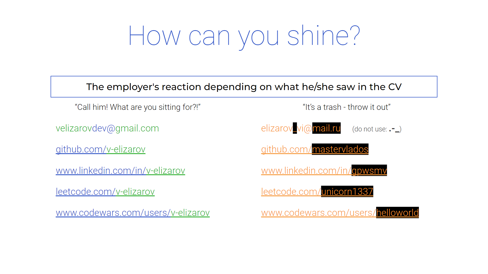
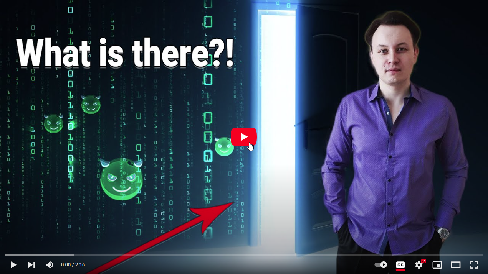
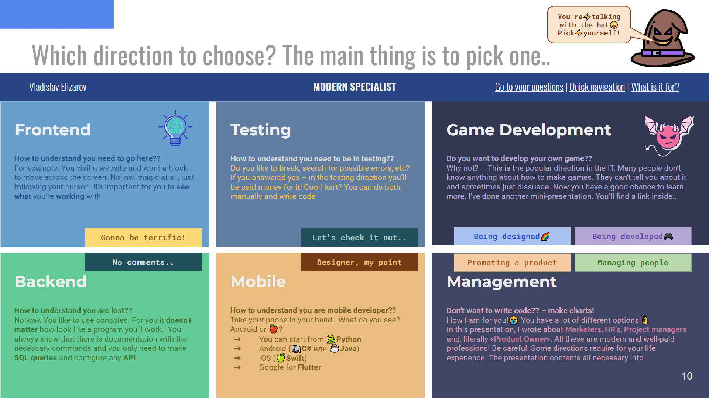
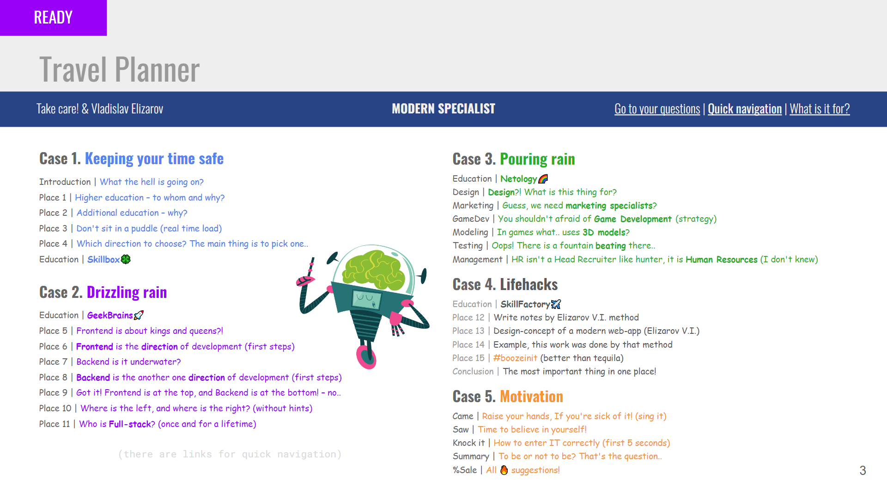
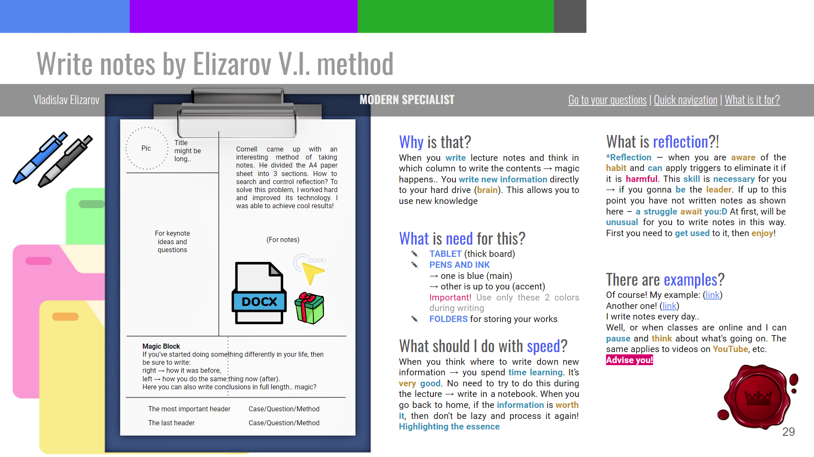

# What is Information Technologies? Hard to gets in? Choosing a direction/profession and your first programming language

[__Русский__](https://github.com/mastervlados/modern-specialist)

Hello! 

I’m Vladislav Elizarov,

in IT people communicate a lot

Good to meet you – Vlad is fine!

__Guess.. you'd like to work in IT?__

Your formation and your career success depends on the decisions you make at the beginning of your journey. This is not easy to do for newbies.. 

I've spent about 5 years to figure it out by myself. However, I've already been there for 8 years.. Did it only 'cause I studied hard and when I graduated from university, I was able to apply my knowledge

Now I am a GeekBrains's student. This is the educational platform. Self-employed, getting a modern digital profession. My duty is to show and tell people how to use all of this. I really think so 

Flew!🐌

* [What is Information Technologies? Enter or become?](#what-is-information-technologies-enter-or-become)
* [There are things you should focus on first!](#there-are-things-you-should-focus-on-first)
* [Your financial success depends on these criteria](#your-financial-success-depends-on-these-criteria)
* [How to become a modern IT-specialist?](#how-to-become-a-modern-it-specialist)
* [My author’s course «Modern Specialist»](#my-authors-course-«modern-specialist»)
* [The most important thing in one place! (Conclusion)](#the-most-important-thing-in-one-place-conclusion)

## What is Information Technologies? Enter or become?
")

Hope you know that the industry exists in our world. Where people-professionals are working, not robots. In fact the average competition for one workplace in IT is about 500 people – the market lacks specialists! This fact is confirmed. You can find and read more. It's not hard to find on the internet

__Why is this so?__ Be honest, I continue to meet people who do not understand where they are going and what they will do. The reason is  the main feature: 

> _«IT doesn't have a physical shell as we are used to»_  

So there is nowhere to enter.. except only in a door of the HR department, a company where specialists are needed

> There's the right way and installation – you only can __become an  IT-specialist__ 

This is very important to realize!  

## There are things you should focus on first!

Here is a list with right questions:

1. What I want to do in IT?

2. Which direction or profession I choose?

If you have answered these 2 questions, then choosing your 1st programming language will take 2 minutes

3. How? So fast!?

The question itself is «__Which programming language to choose?__» - wrong. Why's that? There is simply no answer.. 

Each programming language has its own place in the market. You shouldn’t worry. No one will not move it from there. This is a long-term practice and the same choice of people in that situation. For your direction already exists a programming language that has shown the market stability. On which people are writing code right now

> _Advice:_ Start writing yours!:D

4. Chose a direction, but you still miss understand.. What to do?

Our world contains information. We're working with it every day. Information in its original form is continuously transmitted to our world. The goal of IT specialists is to figure out how to «know» or digitize it. Modern business needs this

When we can manage information (can record it, process it, call it where necessary, etc.), then we can try to make a business decision. While excluding the possible participation of a person from that process. This is called «__Automation__»

5. Motivation? Just for money?

I understand that IT industry attracts with its impressive salaries. It's true, but only monetary motivation will not help you become a professional. If you haven't come up with anything better, here's my setup:

> _«be a modern and in-demand specialist that is needed your country»_

Advise you to read my article to the end. In order to help you answer the first 2 questions, I created my first author's course «Modern Specialist». This is a computer presentation (Google Slides service). Don't worry! The link will be here, below..

## Your financial success depends on these criteria

Answer:

1. __Present Simple & Present Continuous__

In Russian we have articles and content that was translated to our language. But there is such a thing as «OOP» (Object-oriented programming). To work with OOP, you need minimal English. Understand «to, in, on, etc.» and a couple of times. You can write and learn new English words. This will give you the ability to read «method signatures» or subroutine headers. In general, you'll interact with the library and expand the functionality as your heart desires. Need English..

2. __Dictionary of English Words__

You need to buy for yourself a dictionary and fill with a pen. Write out new words and sometimes repeat them. When you write, you remember better. You shouldn’t waste of your time and look for new words to memorize and write down. It'll appear when you're learning or studying. Don't be lazy and be positive to write them out to the dictionary. No, you can't put an extension.. no.. Ballpoint pen, dictionary. Write all words in the 1st form. I use [this](https://englishmore.ru/verbs) and [this](https://wooordhunt.ru/word/delusion) services

3. __You go onward to new, and don’t push away__

How modern you are and don't afraid to try new things: 

* install plugins and extensions for your IDE
* learn keyboard shortcut and do your job faster 
* learn touchtyping method and it might takes your time
* use methods to work with information
* use online converters, services
* search for answers in Google, etc.

4. __How are you in-demand – shine and confident in yourself__

 

Just look carefully at the picture. I have 2 **GitHub** profiles. One is **@mastervlados** another one is **@v-elizarov**. Last one, my main. I've sat down more than once to write my «ToDo List» for my portfolio, but after a while it becomes what I need. It's a pity to spread it.. Recommend **2 profiles**:

__Alt__ – place where you should drop all stuff that aren't complete project. If a employer like you, you always can show that code and completed tasks to her/him

> _Hint:_ Example, your homework from courses..   

__Main__ – place where you should drop your portfolio! 

> _Hint:_ __1__ repository = __1__ project

Employers aren't interested! – how you solve tasks, write algorithms, etc. He/she give you their task at an interview and will enjoy your suffering. Try to not be scare! Everyone goes through this

Employers want to see one or couple of projects with the technology stack which currently uses in their projects. That's it! Manage your garbage please – post only completed projects to your main profile

> __Completed project__ = __1__ finished __business__ = ability to __finish what__ you __started__

5. __Your level of knowledge about the main technology and business__

It's no accident here (5th place). Everyone understands everything and this is what you'll do at work. Employers want to be sure that you are worth time and money. For the first 6 months in your first job you'll bring losses to a company. They will invest only if you are modern and in-demand!

## How to become a modern IT-specialist?

I know several options for how to do this:

* __Travel to study in a university and get specialized hight education__ 

This is your option if you are young and smart enough for this. Apply in full-time (day-time) and study hard. Be sure to try applying for a budget!

> _«To build your career in IT you __need__ higher education»_

* __Complete commercial IT courses and get a diploma__

This option is suitable for people with non-core higher education and who haven't yet received higher education at all. For people who want to change direction or go to work in IT from another field. Anyway you'll be called switcher:D

> _«To become an IT-specialist you __don’t need__ higher education»_

IT-specialist, newbie needs to get a proof. With that proof employers will understand which specialist and what kind of work can be entrusted

> _Hint:_ Need a __document__ that confirm your attitude to IT

Say a few words about self-learning. You can learn a technology, article or any other resource in order to solve a problem by yourself. When you set yourself the task of becoming an IT specialist through self-learning - as a result, you risk finally losing motivation

In courses you'll have:

* Deadlines (days when you have to finish tasks)

* Training program and the end goal

* Opportunity to seek help from a:
    * mentor 
    * teacher
    * student (classmates)

* Seminars (you need to pull your hand and say I did it!)

> In the end, you receive a __document__ that has business __value__ and the __basis__ for employers to consider your CV for an appropriate position

__When you get inside courses, you need to be proactive__

You’ll be enrolled in a group and you should - befriend, __find friends__. Discuss homework. To help others solve what worked for you and failed for another. Always remember that the learning process is individual for each of you. __Do not violate__ the boundaries of another person if you know more

> You'll have a __code review__ and leave comments

You need to write out comments and work through them. Remember, this is not a request.. As a result, your __goal__ is knowledge, practical skills, friends and completed projects paired with someone (team work experience)

> __Document__ – is a __proof__ of your __goal__ 

I recommend you don't communicate with people who don't interested of develop yourself like you. They'll stop and hate you. You should stop communicating with them. When you enter a course - avoid skeptics. You shouldn't try to help them - this is psychologies duty.. Skeptics aren't close-to-this-world-people and any opportunities. Your main task is to walk past and don't touch them - become an IT-specialist and get a job

> Say it again - only __open__ to this world, technology and opportunities a __person__ - might get result in IT and not for only.. 

Courses definitely introduce you to other programming languages! It will hit your comfort zone hard if you have chosen only one for life. Even wrote and talked about it in support and on the phone. This is a step where negative feedback about educational platforms come from..

__Got it!__

Your __main programming language__ is that one you'll work with __frameworks__ (friends), observe specifics of writing programs, read community posts, etc. There is __nothing wrong__ working with other programming languages. This help you (over time) see shortcomings of your main language..

Philosophy of your first programming language is to help you fight with with difficulties in learning related disciplines and programming at the beginning of the journey. In real you have to work with different languages - they are like tools. The earth can be dug with a grinder tool (C++) or a shovel (Python)

## My author’s course «Modern Specialist»

Your formation and your career success depends on the decisions you make at the beginning of your journey. This is not easy to do for newbies.. For this reason I've grabbed and prepared for you answers to questions. I asked myself these questions at the beginning of my journey

Be cool, if you show interest to IT-industry after my presentation. Start find for additional info by yourself. Learn your first necessary skill for your future job - __finding information__

Course «__Modern Specialist__» is an interactive presentation. Means, it contains buttons, you should click on them and links you can travel. It has been __finished__ and you have full access to info!

__EN__ | Modern Specialist:

https://docs.google.com/presentation/d/1BWUftfRBaaCmF9J62uKrn48FwWayoTl2Q8Gagu-rChU/edit?usp=sharing

> _Advice:_ Take your time and inspect the photo above!  

This gonna help you to be effective from the start! You find my method of writing lecture notes and other gifts inside! Don't be afraid to print and use it. Worth to try! Be open for new - skill you need to be any IT-profession! not for only..

## The most important thing in one place! (Conclusion)

There are enough bloggers and teachers who teach how to build «ToDo List» app. In my YouTube channel I focus on how get results and achieve goals. Be confident in yourself. I am friendly to share with you my experience and methods of working with information 

In our business (as in any other) there are harmful, negative factors:

* Stress
* Pressure
* Burn out
* Stagnation (Procrastination)
* Student syndrome
* Impostor syndrome

Each factor leads to a loss of motivation. The most dangerous thing is they work together. Personally, more than one time encountered them. Over time, I protected myself and developed a defense against them. I gonna share how it possible to do 

I talk with people around this world and ask them questions. I’m studying at modern online-platforms. Doing this to provide you useful info about modern IT. To help you figure and join!

_Cheers, Vlad_

[__YouTube__](https://www.youtube.com/@gpwsmv) | [__ВКонтакте__](https://vk.com/ultimatrue) | [__Article on GitHub__](https://github.com/v-elizarov/modern-specialist)